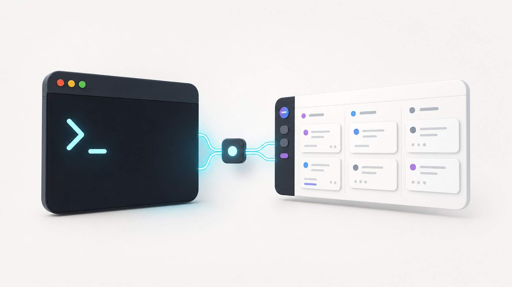

# linear-axi



Agent-friendly Linear from your shell.

`linear-axi` is a Bun CLI for Linear workspaces. It is built for agents: compact [AXI](https://axi.md/) output in TOON, strict exit codes, self-correcting errors, a standalone executable, and browser-based OAuth login.

## Install

Build and install a standalone executable from source:

```sh
git clone https://github.com/henrikkvamme/linear-axi.git
cd linear-axi
bun install
bun run build
mkdir -p ~/.local/bin
install -m 0755 dist/linear-axi ~/.local/bin/linear-axi
```

The compiled `linear-axi` executable is self-contained. It does not need Bun, `node_modules`, or a source checkout at runtime.

Alternatively, install the Nix flake package:

```sh
nix profile install github:henrikkvamme/linear-axi#linear-axi
```

The flake supports Apple silicon macOS and x86-64 Linux.

## Build and capability identity

Every release artifact reports machine-readable provenance without credentials or network access:

```sh
linear-axi capabilities
linear-axi capabilities require \
  --api-level 2 \
  --capability mutation-identity-v1 \
  --capability attachment-files-v1
```

The output includes package version, exact immutable build revision, API level, bundled official-inventory date and SHA-256, named capabilities, and bundled-skill convergence metadata. `--version` is an alias for the same structured output. Compiled and Nix release builds fail when an exact revision is unavailable. Direct `bun src/main.ts` development invocation identifies its revision as `development`.

`capabilities require` exits `0` when satisfied. Missing API levels or capabilities exit `1` with current and missing values plus the managed update command. It never loads credentials or calls Linear.

## Login

```sh
linear-axi auth login
```

The command opens Linear OAuth in your default browser, lets you choose the intended workspace, and writes the token to `$XDG_CONFIG_HOME/linear-axi/credentials.env`, or `~/.config/linear-axi/credentials.env` when `XDG_CONFIG_HOME` is unset, with private permissions. No OAuth app registration or token paste is required.

For a remote agent using the shared browser, run `linear-axi auth login --notify`. The agent opens the exact OAuth URL in the shared browser and keeps the CLI alive until authorization completes. Use `linear-axi auth login --no-open` to print the URL and wait for authorization without launching a local browser.

If your browser lands on `127.0.0.1` and says the site cannot be reached, paste the full callback URL into the still-running CLI.

Rerun `linear-axi auth login` to switch workspaces or replace an expired credential. To disconnect completely, revoke the OAuth grant in Linear and delete the configured credentials file.

After login, verify `auth status` reports the intended workspace stable ID or URL key and `teams list` contains the intended team. Workspace names are display-only and are never accepted as the sole mutation security match.

You can also set credentials yourself in the process environment, a repo-local `.env`, or the user credentials file:

```dotenv
# Choose one:
LINEAR_API_KEY=lin_api_...
LINEAR_ACCESS_TOKEN=...

# Optional:
LINEAR_TEAM=BEN
```

Process credentials override file credentials. The OAuth credentials file overrides repo-local `.env` credentials so a successful login selects the new workspace; repo credentials are used when no OAuth credentials exist, followed by `secrets.env` in the same user config directory. Other settings use process, repo, OAuth, then managed precedence. Within one source, `LINEAR_API_KEY` takes precedence over `LINEAR_ACCESS_TOKEN`.

Set `LINEAR_AXI_ENV_FILE` in the process environment to use a specific credentials file for both login and later commands. In that mode, credential precedence is process, explicit file, then repo `.env`, and the default OAuth and managed files are not loaded. `HOME`, `XDG_CONFIG_HOME`, and `LINEAR_AXI_ENV_FILE` values inside dotenv files are ignored so a repository cannot redirect credential storage.

## Use

```sh
linear-axi auth status
linear-axi teams list --limit 50
linear-axi issues list --assignee me --limit 20
linear-axi issues list --team BEN --label wayfinder:map --state open --limit 100
linear-axi issues list --parent BEN-100 --assignee none --state open --limit 100
linear-axi issues view --id <issue-id-or-key> [--full]
linear-axi issues create --team <key-or-id> --title "..." --expect-workspace <workspace> --expect-team <team>
linear-axi issues assign --id <issue> --assignee me --expect-workspace <workspace> --expect-team <team>
linear-axi issues unassign --id <issue> --if-assignee me --expect-workspace <workspace> --expect-team <team>
linear-axi issues close --id <issue> --expect-workspace <workspace> --expect-team <team>
linear-axi workflow-states list --team <team>
linear-axi issues state --id <issue> --state "In Progress" --expect-workspace <workspace> --expect-team <team>
linear-axi issues parent set --id <child> --parent <parent> --expect-workspace <workspace> --expect-team <team>
linear-axi issues parent clear --id <child> --expect-workspace <workspace> --expect-team <team>
linear-axi issues update --id <issue> --description-file <path> --if-updated-at <timestamp> --expect-workspace <workspace> --expect-team <team>
linear-axi labels list --workspace --name <exact-name>
linear-axi labels list --workspace --include-archived --fields id,name,archivedAt
linear-axi labels create --workspace --name <name> --color '#5E6AD2' --if-absent --expect-workspace <workspace>
linear-axi labels add --issue <issue> --label <label> --expect-workspace <workspace> --expect-team <team>
linear-axi labels remove --issue <issue> --label <label> --expect-workspace <workspace> --expect-team <team>
linear-axi labels replace --issue <issue> --labels-json '["Bug","Urgent"]' --expect-workspace <workspace> --expect-team <team>
linear-axi relations create --issue <blocked-issue> --blocked-by <blocker-issue> --expect-workspace <workspace> --expect-team <team>
linear-axi relations list --issue <blocked-issue> --blocked-by
linear-axi relations create --issue <blocker> --related-issue <blocked> --type blocks --expect-workspace <workspace> --expect-team <team>
linear-axi relations list --issue <issue> --type blocks --direction both
linear-axi relations remove --issue <blocked> --blocked-by <blocker> --expect-workspace <workspace> --expect-team <team>
linear-axi comments list --issue <issue> --limit 50
linear-axi comments create --issue <issue> --body-file <path> --id <retained-uuid-v4> --expect-workspace <workspace> --expect-team <team>
linear-axi attachments list --issue <issue> --limit 100
linear-axi attachments view --id <attachment-id>
linear-axi attachments read --id <attachment-id> [--max-bytes <n> | --full]
linear-axi attachments download --id <attachment-id> --output <path> [--overwrite] [--max-bytes <n>]
linear-axi attachments upload --issue <issue> --file <path> --expect-workspace <workspace> --expect-team <team>
linear-axi wayfinder frontier --map <map-issue> --first 20
linear-axi <command> --help
```

See the bundled [command reference](.agents/skills/linear-axi/COMMANDS.md) for the complete generated reference for flags, usage, examples, and command-specific safety guidance.

### Official MCP parity

The frozen authenticated inventory contains 47 official tools observed on 2026-07-20. The checked [parity manifest](docs/linear-mcp-parity.json) maps every tool exactly once, and [the captured schemas](docs/official-linear-mcp-tools.json) preserve the names, descriptions, and input schemas used for this release. `official` mappings call the hosted tool, `native` mappings use the SDK equivalent, `native+official` combines both routes, and the two decision statuses record intentionally unavailable operations or safe partial coverage with a rationale. `bun run parity:check` fails when the inventory, manifest, implemented command surface, or generated skill reference drifts.

Official-backed commands initialize `https://mcp.linear.app/mcp` with the one credential selected by the Login precedence rules above and close the session when the command finishes. They need no separate MCP server configuration or second credential. The MCP transport sends the credential in the Bearer authorization header and redacts its exact value from translated transport and tool errors.

The practical object surface includes attachments, projects, documents, cycles, milestones, project labels, releases, release notes, release pipelines, users, agent skills, diffs, status updates, and documentation search. Read commands use `list`, `view`, `search`, or `inspect`; safe updates use `update`. Default list output is minimal and paginated. `--full` disables local projection and text truncation, but associations still require their explicit inclusion flags.

Official create operations without a caller-supplied id, destructive deletes, and remaining unbounded binary/image operations are recorded as `needs-decision` or `partial-needs-decision` with a recommended scoped design. They are not silently omitted or exposed as retry-unsafe mutations. Advanced issue creation is the exception: it requires `--if-absent`, performs a team/title exact-match preflight, and uses one `save_issue` mutation. Safe file attachment upload is the other scoped exception and uses the official resumable prepare, direct PUT, and finalize flow described below. Product-object updates resolve mutable selectors to immutable IDs before mutation. If an official save fails after dispatch without a definitive response, inspect with the exact read-only command in the error before deciding whether another mutation is safe.

### Attachments

`attachments list` resolves one exact issue and returns selectable attachment metadata without signed URLs. Its continuation cursor binds to the exact attachment membership and order, so a changed page fails with guidance to restart without `--after` instead of skipping or repeating attachments. `attachments view` reports metadata and whether authenticated content is available, again without exposing the content URL or headers. `attachments read` renders UTF-8 `text/*`, JSON, XML, YAML, TOML, JavaScript, SQL, and SVG content with no charset or an explicit UTF-8 charset. It defaults to 32 KiB, makes terminal control bytes explicit, and accepts either `--max-bytes <n>` up to 1 MiB or the mutually exclusive `--full` 1 MiB ceiling. Empty text is a successful definitive result. Raster images and other binary files must be downloaded and inspected with the appropriate local tool, never printed as bytes or base64.

`attachments download` streams to a private temporary file in the destination directory, verifies the expected size and available SHA-256, fsyncs, and installs without replacing another file. The destination directory must already exist and must not resolve through a symlink. Existing destinations are always refused because the supported OS primitives do not provide atomic expected-file replacement; `--overwrite` records explicit intent but fails closed when a destination exists. The default download ceiling is 1 GiB; use `--max-bytes <n>` for a smaller or explicitly larger bound up to 2 GiB minus one byte. Safe local upload and download operations require macOS or Linux.

Every live `attachments upload` requires explicit `--issue` and `--file` intent. The source must be a stable, non-empty, non-symlink regular file. Media type is inferred for `.txt`, `.md`, `.csv`, `.json`, `.yaml`, `.yml`, `.xml`, `.toml`, `.js`, `.mjs`, `.ts`, `.tsx`, `.html`, `.css`, `.sql`, `.svg`, `.png`, `.jpg`, `.jpeg`, `.gif`, `.webp`, `.pdf`, `.zip`, `.gz`, `.mp4`, and `.mov`; `--media-type` may override inference with one of these parameter-free values: `text/plain`, `text/markdown`, `text/csv`, `application/json`, `application/yaml`, `application/xml`, `application/toml`, `application/javascript`, `text/typescript`, `text/tsx`, `text/html`, `text/css`, `application/sql`, `image/svg+xml`, `image/png`, `image/jpeg`, `image/gif`, `image/webp`, `application/pdf`, `application/zip`, `application/gzip`, `video/mp4`, or `video/quicktime`. Uploads default to 100 MiB; `--allow-large` is explicit and raises the ceiling to 2 GiB minus one byte. The CLI hashes and stats the open file before its first Linear request, resolves the exact issue, prepares one short-lived signed PUT, streams bytes without the Linear bearer token, finalizes by the stable asset URL, and verifies the attachment. Private mode-0600 recovery records under `$XDG_STATE_HOME/linear-axi/uploads`, or `~/.local/state/linear-axi/uploads` when `XDG_STATE_HOME` is unset, support interruption and response-loss recovery without storing the source path, bearer token, signed upload URL, or signed headers. Retrying the same issue, unchanged file, media type, title, and subtitle reconciles an already-finalized attachment before any mutation. The deprecated base64-heavy `create_attachment` path and destructive attachment deletion remain excluded.

`--description-file -` and `--body-file -` read from stdin. `issues view` truncates descriptions to 1,200 characters by default and reports the original length. Official detail commands apply the same limit to body, content, description, instructions, and text fields, report every truncated field and original length, and provide an exact `--full` command. Pass `--full` before merging or replacing rich text. Data, help, errors, no-ops, and definitive empty states are TOON on stdout. Successful mutations include `changed` and `result`; an already-satisfied mutation is a no-op with exit code `0`.

Conditional official command contracts are validated before network access:

- `comments search` requires exactly one parent flag. `--status-update-type` is valid only with `--status-update-id`.
- `documents update` accepts at most one new parent among project, issue, initiative, and cycle. `--team` identifies a cycle's team and may accompany `--cycle`; without a cycle it participates in the one-parent constraint.
- `release-notes update` requires `--range-from` and `--range-to` together, and the range form cannot be combined with `--releases-json`.
- `status-updates update` accepts at most one of `--project` and `--initiative`, and that parent must match `--type`.
- Every official `update` requires at least one property. Set and clear forms are mutually exclusive, and every date, timestamp, numeric range, and JSON-array flag is validated before dispatch.

### Resolution, filters, and pagination

Team keys, issue identifiers, and label names are matched exactly without case sensitivity. UUIDs identify one exact object. Identity resolvers scan every matching page and never select the first match: active teams, issues, labels, and workflow states must be unique, while missing, archived, and ambiguous matches fail. Retry an ambiguity with the intended UUID. Official detail commands likewise verify that the returned immutable ID or documented stable alias exactly matches the requested selector. Product updates canonicalize mutable selectors before dispatch, reject archived targets and additions, and verify project, team, or pipeline ownership where the association is scoped; collection removals may resolve archived associations so cleanup remains possible. Archived or disabled users remain valid for issue filters and unassign preconditions, but assignment requires an active, unarchived, assignable user. When `--team` and `--parent` are combined for listing or creation, the parent must belong to that team. Label names used with an issue resolve uniquely among active workspace labels and labels for the issue's team.

`issues list` supports team, exact label, direct parent, assignee (`me`, `none`, or a user UUID), and open or closed state filters. Open excludes the three terminal workflow types: completed, canceled, and duplicate. Closed includes all three. Its default fields are `id,identifier,title,state`; `--fields` accepts `id,identifier,title,state,assignee,parent,labels,updatedAt,url,subIssueSortOrder`.

`labels list` can search all labels or select workspace, team, or issue scope. Label lists return active labels by default. Pass `--include-archived` to include archived labels. The default fields are `id,name,scope`; `--fields` also accepts `color,description,isGroup,parentId,archivedAt`. In contrast, issue details, mutation results, and `issues list --fields labels` retain the names of all attached labels, including archived labels; use `labels list --issue <issue> --include-archived --fields id,name,parentId,archivedAt` to inspect their status and group.

`issues list`, `labels list`, `relations list`, `comments list`, and `attachments list` return `page.endCursor` when another page exists. Pass that exact value to the same command with `--after`. Attachment cursors reject continuation if membership or order changed, preventing incomplete or duplicated traversal. Wayfinder frontier instead returns `pageInfo.endCursor` and uses `--first`; `--limit` remains an alias for `--first`, but the two flags cannot be combined. Relation pages and issue-scoped exact-name label pages are recomputed from current data and are not snapshot-isolated, so restart without `--after` when current membership matters.

### Mutation safety

Every native, official-backed, and attachment mutation requires `--expect-workspace <workspace-uuid-or-url-key>`. Team-scoped mutations accept `--expect-team <team-key-or-uuid>` and verify the resolved target team. Missing expectations are usage exit `2`. A live `workspace_mismatch` or `team_mismatch` is exit `1`, emits expected and actual stable identities, and makes zero mutation calls. Identity lookup itself is read-only.

Issue, label, relation, and comment creation accept a caller-retained UUID v4 with `--id`. Repeating the same request with the same UUID is a no-op, while reuse for different content or scope is a conflict. Rich-text retry comparisons tolerate normalized line endings, trailing newlines, and Linear's angle-bracket form for HTTP(S) Markdown links. `labels create --if-absent` also treats a case-insensitive same-name label with matching properties in the requested scope as a no-op. `labels create --group` creates a top-level group; `--parent` creates an ordinary child under a top-level group in the same scope, and the two flags cannot be combined. Attaching or replacing issue labels accepts ordinary labels only and at most one child from each label group. `labels replace --labels-json '[]'` clears all labels. A directed relation is a no-op when its source, target, and type already exist, even without `--id`.

Issue state, parent, label add/remove/replace, and relation removal mutations read back the requested state. If a dispatched mutation cannot be reconciled, follow its exact read-only inspection command and do not repeat the mutation while the outcome is unknown. Within one update, the same canonical team, initiative, release, or issue relation cannot appear in both add and remove sets.

Assignment is a verified claim convention, not an atomic claim. By default, assigning an already-assigned issue conflicts; `--replace` permits a deliberate overwrite. Wayfinder agents must not use `--replace` to claim work and should release only their own assignment with `--if-assignee`. Another writer can still race between the read and update.

Without `--state`, `issues close` is a no-op for an already terminal issue and otherwise selects the team's only completed workflow state. If the team has multiple completed states, pass the intended active completed-state UUID with `--state`; an explicit state transitions unless the issue is already in that exact state.

Issue descriptions and official product-object rich text must be replaced only with `--if-updated-at` set to the exact canonical `updatedAt` emitted by the latest full view. This covers document and release-note content, project, release, and milestone descriptions, and status-update bodies, including their explicit `--clear-content`, `--clear-description`, and `--clear-body` forms. Optional project summaries use `--clear-summary`. The CLI rejects malformed or stale timestamps, refetches after a write, and verifies the requested text. Linear does not expose an atomic compare-and-swap precondition, so an edit can still land in the final read/write window. Refetch and merge after any conflict, and never retry stale full text.

Use `relations create --issue <blocked-issue> --blocked-by <blocker-issue>` when one issue blocks another. The shorthand deliberately reads from the blocked issue's perspective: it maps the blocker to Linear's source, the blocked issue to Linear's target, and the type to `blocks`. Create output names both `blockedIssue` and `blockerIssue`. `relations list --issue <blocked-issue> --blocked-by` lists incoming `blocks` relations, names the query once as top-level `blockedIssue`, and uses `blockerIssue` instead of the generic `identifier` in each relation row. The shorthand cannot be mixed with the generic relation flags.

The generic API remains available for every directed relation type. Relations are tuples of source, target, and type (`blocks`, `related`, `duplicate`, or `similar`). In `relations create --issue <blocker> --related-issue <blocked> --type blocks`, `--issue` is the source blocker and `--related-issue` is the target blocked issue. Generic relation lists report each match as `outgoing` or `incoming`; `--direction` defaults to `both`. Both create forms preserve caller-retained UUID and natural-key idempotency. Every `blocks` creation rejects self-blocking after issue references resolve, including when two different references identify the same issue.

Comment bodies are truncated to 500 characters in lists unless `--full` is passed. `--body-file` avoids shell quoting for canonical resolution comments.

### Wayfinder frontier

`wayfinder frontier` is the single Wayfinder-specific projection. A production map must have exactly one active `wayfinder:map` label. An isolated verification map may instead use one `WF-VERIFY-<run>:map` label, where `<run>` contains only letters, digits, dots, underscores, or hyphens; its four type labels use that same prefix. Before loading candidates, frontier requires all four active, ordinary, non-group type labels to resolve uniquely among workspace and map-team labels, even when the map has no candidates: `<prefix>:research`, `<prefix>:prototype`, `<prefix>:grilling`, and `<prefix>:task`. Its active, direct children enter the frontier only when they are open, unblocked, and unassigned. Every current frontier candidate must have exactly one of those four type labels.

Results are ordered by Linear's manual sub-issue order with unset order last, then creation time, then UUID. Every page recomputes current Linear state and does not provide snapshot isolation, so membership or ordering changes can move issues across the cursor. Restart without `--after` when a fresh frontier is required.

Exit codes:

- `0` success
- `1` runtime, auth, Linear API, not-found, ambiguity, or conflict error
- `2` usage error detected before dependencies are called

## Agent Skill

Install the public skill with Vercel's `skills` CLI:

```sh
npx skills add henrikkvamme/linear-axi --skill linear-axi
```

Only `linear-axi` is intended to be installable from this repo.

## Develop

```sh
bun run check
```

After changing command specs or help, run `bun run skill:generate` to refresh the bundled command reference. To refresh the frozen official inventory, authenticate locally and run `bun run parity:capture --date YYYY-MM-DD`, then update the parity manifest's observation date, inventory hash, mappings, and rationales. Do not hand-edit the generated inventory. `bun run parity:check` verifies the inventory, manifest, command capabilities, and generated reference agree.

Effect source is vendored under `repos/effect` as read-only reference material. Application code imports package dependencies, not the vendored source.
